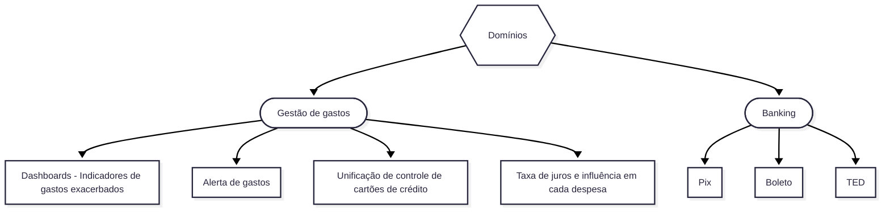
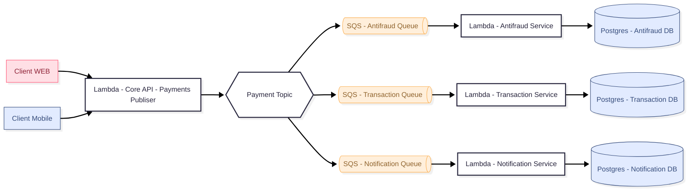

# Harmonia Financeira

## Descrição 

Um monorepo com um sistema de pagamentos simulado e gestão de contas familiar.

## Requisitos

- [Funcionais](./docs/requisitos/rf.md)
- [Não funcionais](./docs/requisitos/rnf.md)

## Domínios de negócio



## Arquitetura

### Despesas

```mermaid
---
config:
  theme: redux
  layout: dagre
  look: neo
---
flowchart LR
    n14["Client WEB"] --> n1["Lambda - Core API - Expenses Publisher"]
    n21["Client Mobile"] --> n1
    n1 --> n3@{ label: "Expenses<span style=\"color:\"> Topic</span>" }
    n3 --> n6["SQS - Transaction Queue"]
    n6 --> n22["Lambda - Expenses Service"]
    n22 --> n18["Postgres - Expenses DB"]
    n18 --> n23["Lambda - DB Trigger - Alert Service"]

    n14@{ shape: rect}
    n1@{ shape: rect}
    n21@{ shape: rect}
    n3@{ shape: hex}
    n6@{ shape: h-cyl}
    n22@{ shape: rect}
    n18@{ shape: cyl}
    n23@{ shape: rect}
     n14:::Rose
     n21:::Sky
     n6:::Peach
     n18:::Sky
    classDef Rose stroke-width:1px, stroke-dasharray:none, stroke:#FF5978, fill:#FFDFE5, color:#8E2236
    classDef Peach stroke-width:1px, stroke-dasharray:none, stroke:#FBB35A, fill:#FFEFDB, color:#8F632D
    classDef Sky stroke-width:1px, stroke-dasharray:none, stroke:#374D7C, fill:#E2EBFF, color:#374D7C
```



### Banking



## Ambientes Docker

### Ver mensagens no tópico

> http://localhost:8080

### Iniciar containers

```zsh
docker compose up
```

## Utils

- [Reset de tópico no Kafka](./docs/kafka/como_deletar_topico.md)
- [Teste de envio de pagamento](./docs/http/POST.http)
