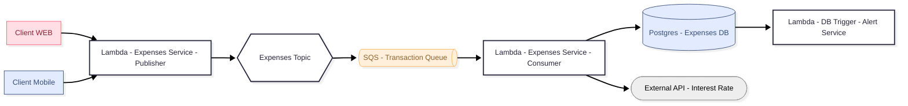
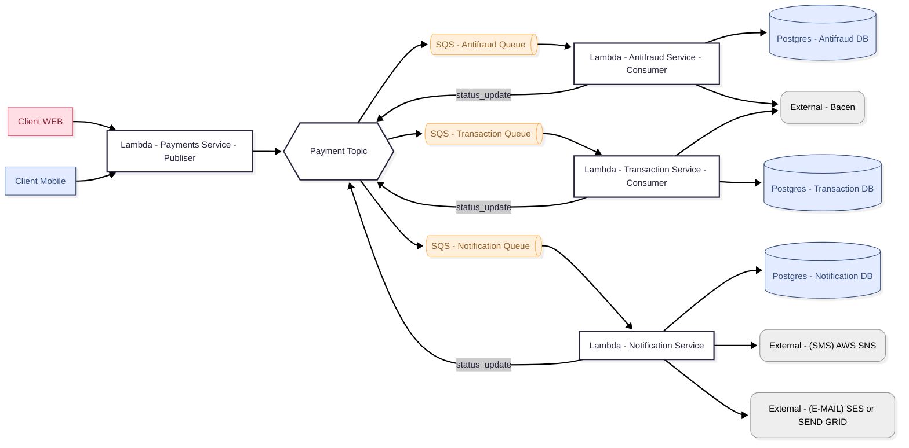

# Harmonia Financeira

## Contexto

Inicialmente esse repositório foi criado para simular um sistema de pagamento com alta concorrência. Porém passei a usa-lo como meu projeto de [TCC](https://docs.google.com/document/d/1JjoOGEuK71dnkTWEYsoSsqkzM1umRoWZ/edit?usp=sharing&ouid=113161032001964584333&rtpof=true&sd=true)
da **pós-graduação de arquitetura**.

## Descrição 

Esse projeto é um monorepo com um sistema de pagamentos simulado e gestão de contas familiar em construção.

## Requisitos

- [Funcionais](./docs/requisitos/rf.md)
- [Não funcionais](./docs/requisitos/rnf.md)

## Domínios de negócio


## Arquitetura

### Despesas



### Banking



## Ambientes Docker

### Ver mensagens no tópico

> http://localhost:8080

### Iniciar containers

```zsh
docker compose up
```

## Utils

- [Reset de tópico no Kafka](./docs/kafka/como_deletar_topico.md)
- [Teste de envio de pagamento](./docs/http/POST.http)
- [Doc do TCC](https://docs.google.com/document/d/1JjoOGEuK71dnkTWEYsoSsqkzM1umRoWZ/edit?usp=sharing&ouid=113161032001964584333&rtpof=true&sd=true)
