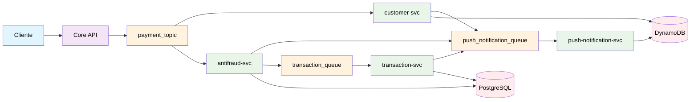

# Concurrency Simulator

## Descrição 

Um monorepo com um sistema de pagamentos simulado, com o objetivo de treinar alguns conceitos importantes e ferramentas que eu acho interessantes de se testar

## Requisitos

- [Funcionais](./docs/requisitos/rf.md)
- [Não funcionais](./docs/requisitos/rnf.md)

## System Flow Diagram



## Ambientes Docker

### Iniciar containers

```zsh
docker compose up
```

## Utils

- [Reset de tópico no Kafka](./docs/kafka/como_deletar_topico.md)
- [Teste de envio de pagamento](./docs/http/POST.http)
